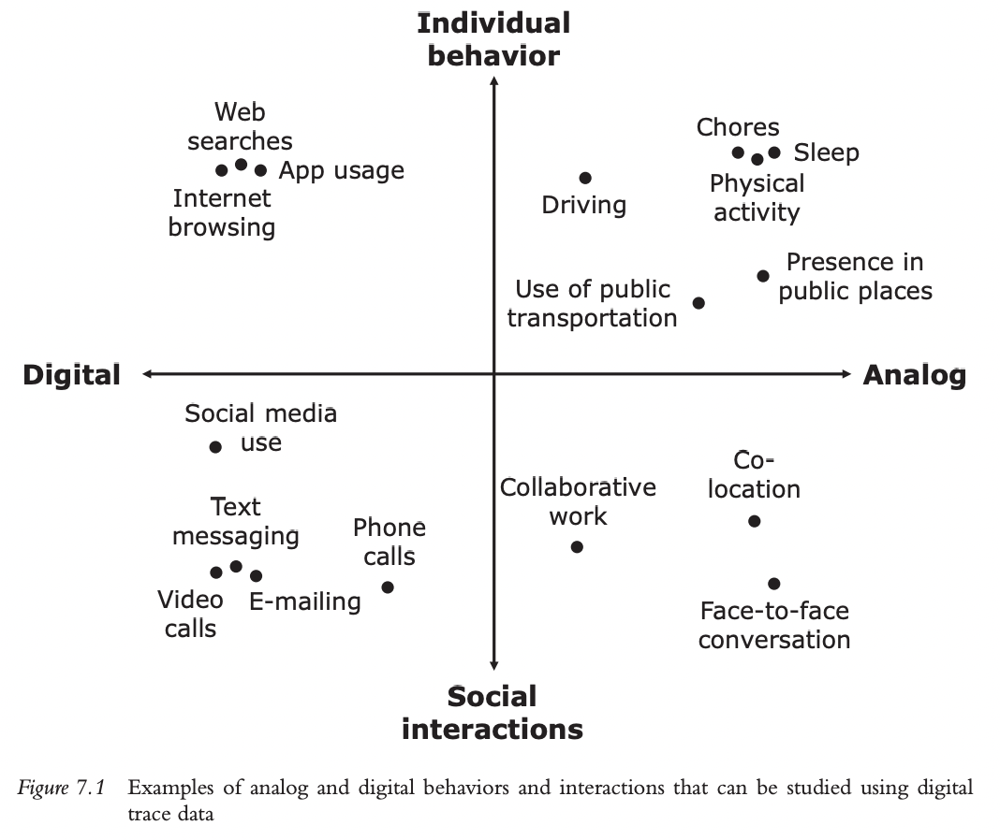

DIGITAL TRACE DATA
Modes of data collection, applications, and errors at a glance

# Intro

**What is digital traces?**

Digital traces, often defined as “records of activity (trace data) undertaken through an online
information system (thus, digital)” (Howison, Wiggins, & Crowston, 2011, p. 769) 

or “behavioral residue [individuals leave] when they interact online” (Hinds & Joinson, 2018, p. 2), provide researchers with new opportunities for studying social and behavioral phenomena

**How digital trace data to answer social science question?**

the true potential of digital trace data to answer a broad range of social science research questions depends on the features of the specific type of data, that is, how they were collected and from whom.

We argue that digital traces can and should sometimes be collected in a designed way to afford researchers control over the data generating process and to expand the range of research questions that can be answered with these data.

**What problem digital traces data may bring?**

- problem of privacy
- quality assurance
- understanding of break-downs in the measurement process.

# Use of digital trace data to study social and behavioral phenomena

## Type of phenomenon to be studied

While the phenomena themselves happen without the use of digital technology, the ubiquity of smartphones, wearables, sensors, and other digital devices leaves a digital trace about them that researchers can leverage.

## Type of observation

Passive measurement:

Depending on the design of the study, the measurement might be perceived as being less
obtrusive over time because participants forget or get used to the presence of the measurement
device. If the only active task for the participant is, for example, to download a research app
or a meter that collects data in the background on their smartphone or Internet browser, then
participants might soon forget that their behavior is even being observed. 

Combination of measurement and self-reports:

However, **wearing a research-grade device on the body will potentially serve as a constant reminder that the individual is part of a study.** Similarly, if the study design involves a combination of passive measurement of digital traces and repeated collection of self-reports (e.g., ecological momentary assessment [EMA] questions multiple times a day), it will probably make participants more aware of the observational part of the study.

## What is the research goal?

To simplify the discussion, we differentiate between three very general research goals irrespective of the data types: description, causation, and prediction.

- description:

1.interpreting 

A first decision has to be made when interpreting the descriptive statistic.
Researchers need to be clear if their aim is to describe a population or only report on the data
at hand.

Restrictions need to be communicated clearly when presenting and publishing the results.

**How to deal with it ?**

Starting with a probability sample has the strong advantage that sampling errors can be estimated; nonresponse error can be adjusted for known covariates; and with sufficient information on the sampling frame, the coverage errors are also known.

2.mislabeling

eg: The Literary Digest went for volume and overlooked issues of selective access to phones and magazine subscriptions when assembling its mailing lists.

Many of the data collection efforts in the COVID-19 pandemic show a similar tendency (see Kohler, 2020 and the associated special issue).

Likewise, using Twitter data as a source to identify areas in need of support after natural disasters (e.g., hurricanes) my misguide policy makers. 

Resources and attention would likely flow towards the younger population, people with easy Internet access, or those generally well connected (Shelton, Poorthuis, Graham, & Zook, 2014).

资源向年轻人倾斜

- causation:

note: Differences in posting behavior (i.e., number of posts, sentiment) between users who were exposed to the treatment and those who were not can be interpreted as the causal effect of the treatment.

While these examples **have internal validity (**albeit to different degrees), they **lack external validity**: inference to the population at large is not possible without further assumptions.

- prediction:

The reason prediction models are popular for such tasks is that they “often do not require specific prior knowledge about the functional form of the relationship under study and are able to adapt to complex non-linear and non-additive interrelations between the outcome and its predictors while focusing specifically on prediction performance” (Kern, Klausch, &
Kreuter, 2019, p. 73).

(只需要关注预测结果的表现）

However, knowing **who is covered by the data, for which settings, and which circumstances or time frames** is just as important here as it is in the description and causal inference setting.

## Quality assessment - quality enhancement

Several frameworks exist that can help characterize data quality (see summaries in Christen, 2012;National Academies of Sciences, 2017). Typical elements are **accuracy, completeness, consistency, timeliness, and accessibility.**

A distinction between data found in the wild and data collected by design:

(While this distinction between data found in the wild and data collected by design highlights an important feature, the data collection itself (say digital trace vs. survey questions) is independent of the found vs. design distinction.)

- Data found in the wild:

Found data are byproducts of interactions with the world that leave digital traces; or, put differently, they arise organically. With found data, researchers have no control over who provides the data and how.

eg: credit card transaction

- Data collected by design:

One major advantage of collecting data through designated research apps is that this allows researchers to specifically design all aspects of the data collection process (e.g., field period, participants’ characteristics, particular sensors used) with a specific research question in mind.

**sum:**

For computational social science to be successful in using digital trace data, we foresee that in
most (if not all) cases, data from different sources need to be combined, either to **overcome the
problem of unknown populations of inference or to overcome the problem of missing covariates and overall unclear measurement properties** (Christen, Ranbaduge, & Schnell, 2020; Couper, 2013; Schnell, 2019).

## Transparency and reporting needs

> There is a long path between the raw data and insights derived from the data.
> 

The United National Statistics Division lists principles governing international statistical activities, including a call for transparency of “concepts, definitions, classifications, sources, methods and procedures employed”. Growing adoption of FAIR data principles – Findability, Accessibility, Interoperability, and Reusability.