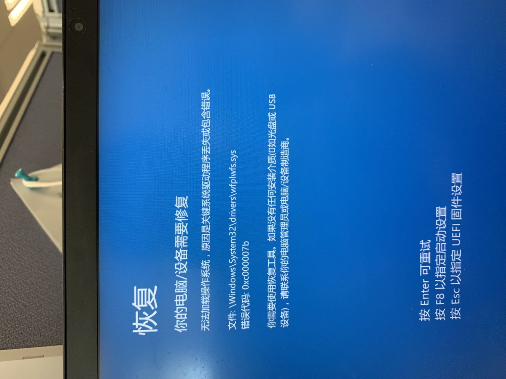

# 20221020 Diary
大大的無語！18號晚上點了一下更新windows，然後在更新過程中突然關機了，還插著電就關機了。這就導致我的電腦進入自動修復然後有無法修復的循環。就像下面這張圖

## 問題
<center></center>

## 解決問題一
我先是嘗試進入安全模式，但是失敗了。然後嘗試通過恢復點還原系統，同樣也沒有跳過自動修復循環。所以我猜測可能是**引導**出錯了。

今天我用PE系統進入上圖所指的文件，在文件底部發現下面這個提示。

```
启动关键文件c:\efi\microsoft\boot\cipolicies\active\{cdd5cb55-db68-4d71-aa38-3df2b6473a52}.cip 损坏
```

所以我通過DiskGenius查看ESP下的EFI文件内容，也找到了那個文件。我的思路是重建一個EFI以獲取未損壞的文件。

- 1. 先是備份之前的EF
- 2. 再刪除ESP下的EF
- 3. 再是跟著這個網站的pe重建[win10引導方法二](http://www.dnxtc.net/zixun/zhuangjijiaocheng/2020-07-03/5071.html)
- 3. 重要cmd代碼： 
```cmd
bcdboot c:windows /s g: /f uefi /l zh-cn
    其中，c:windows 指硬盘系统目录，根据实际情况修改
         /s g: 指定esp分区所在磁盘，根据实际情况修改
         /f uefi 指定启动方式为uefi
         /l zh-cn 指定uefi启动界面语言为简体中文
```
- 4. 這個時候在ESP下囘出現新的EFI, 把新的好的{cdd5cb55-db68-4d71-aa38-3df2b6473a52}.cip文件替換之前備份的損壞的{cdd5cb55-db68-4d71-aa38-3df2b6473a52}.cip文件，
- 5. 刪除新的EFI, 把舊的整個EFI文件放回ESP裏。

然後沒有提示無法自動修復了，但是出現了新的問題。

## 解決問題二
```
文件：\windows\system32\drivers\wfplwfs.sys 出錯
```
<center></center>

我看説的是驅動程序出錯，就嘗試到網上直接下載一個，然後替換上去。在這個下載的[How To Fix Wfplwfs.sys BSOD Error (Bluescreen)](https://www.solvusoft.com/en/files/bsod-blue-screen-error/sys/windows/microsoft/windows/wfplwfs-sys/)。

在pe中替換了這個文件，就成功進入了系統。但是網絡無法連接，右下角根本沒有wifi選項。

## 解決問題三
在網絡上看了好多教程，這個比較全面[tutorial](https://www.pchealthcheck.net/1620.html)。

嘗試了無數種方法后，我卸載了最新的質量更新，就是一切問題起源的更新，然後網絡成功回復！

## The End !!!!!!


