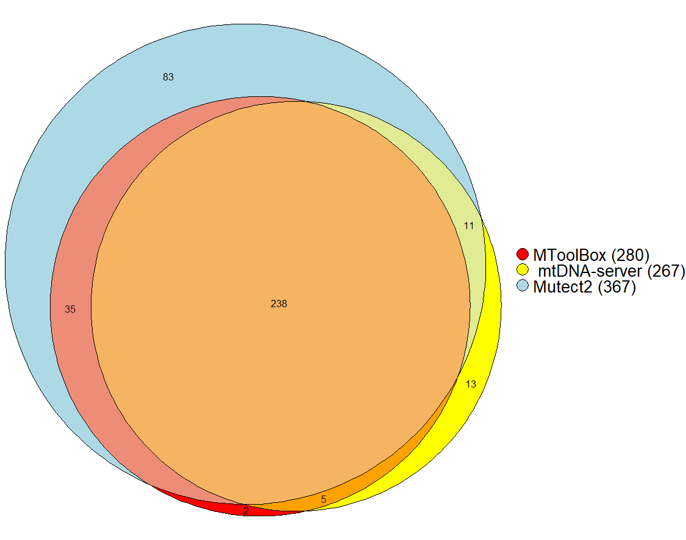

## Aim: Plot the venn plot like this.
<center></center>

## Using R package
```R
library(eulerr)
input = euler(c(MToolBox = 2, 
                'mtDNA-server' = 13, 
                = 83, "MToolBox&mtDNA-server" = 5, 
                "MToolBox&Mutect2" = 35, 
                "mtDNA-server&Mutect2" = 11, 
                "MToolBox&mtDNA-server&Mutect2" = 238))

plot(input, 
     fill = c("red", "yellow", "lightblue"),
     legend = list(side = "right", labels = c("MToolBox (280)" ," mtDNA-server (267)", "Mutect2 (367)"), fontsize = 20),
     quantities = TRUE)
```
